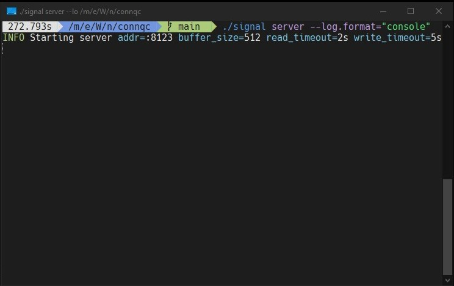
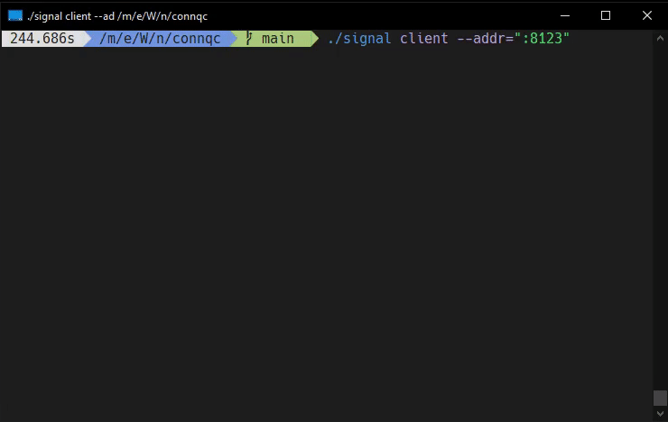

# Connection Quality Checker

<p align="center">
    <a href="#license">
        
    </a>
    <a href="https://goreportcard.com/report/github.com/nitrado/connqc">
        
    </a>
    <a href="https://github.com/nitrado/connqc/releases/latest">
        
    </a>
    <a href="https://pkg.go.dev/github.com/nitrado/connqc">
        
    </a>
</p>

`connqc` is a tool to control the quality of the network transport between multiple regions.
It consists of a server that listens for TCP probing messages, and a client that sends said messages.
The client logs the probing duration and warns if some messages get lost.

## Usage

<p align="left">
        
</p>

<p align="right">
        
</p>

### Server

Start the server. The default address is `:8123`:

```shell
$ connqc server 
```

or specify a port:

```shell
$ connqc server --addr=":1234"
```

#### More Options

The `server` command supports the following additional arguments.

```shell
OPTIONS:
   --addr value                         The address to listen on for probe messages (default: ":8123") [$ADDR]
   --buffer-size value                  The size of the read buffer used by the server (default: 512) [$BUFFER_SIZE]
   --read-timeout value                 The duration after which the server should timeout when reading from a connection (default: 2s) [$READ_TIMEOUT]
   --write-timeout value                The duration after which the server should timeout when writing to a connection (default: 5s) [$WRITE_TIMEOUT]
   --log.format value                   Specify the format of logs. Supported formats: 'logfmt', 'json', 'console' [$LOG_FORMAT]
   --log.level value                    Specify the log level. e.g. 'debug', 'info', 'error'. (default: "info") [$LOG_LEVEL]
   --log.ctx value [ --log.ctx value ]  A list of context field appended to every log. Format: key=value. [$LOG_CTX]
   --help, -h                           show help
```

#### Firewall

For use on firewalls managed with [`firewall-cmd`](https://firewalld.org/documentation/man-pages/firewall-cmd.html):

```shell
$ firewall-cmd --add-port=8123/tcp
# and later after the test is done
$ firewall-cmd --remove-port=8123/tcp
```

### Client

Start the client with the connqc server's address:

```shell
$ connqc client --addr="127.0.0.1:8123"
```

To enable more human-readable logs, set the log format:

```shell
$ connqc client --addr="127.0.0.1:8123" --log.format="console"
```

To increase the amount of sent requests, reduce the interval:

```shell
$ connqc client --addr="127.0.0.1:8123" --interval="200ms"
```

#### More Options

The `client` command supports the following additional arguments.

```shell
OPTIONS:
   --tcp                                Use TCP protocol for the connection (default: false) [$TCP]
   --udp                                Use UDP protocol for the connection (default: false) [$UDP]
   --addr value                         The address of the connqc server [$ADDR]
   --backoff value                      The duration to wait for before retrying to connect to the server (default: 1s) [$BACKOFF]
   --interval value                     The interval at which to send probe messages to the server (default: 1s) [$INTERVAL]
   --read-timeout value                 The duration after which the client should timeout when reading from a connection (default: 2s) [$READ_TIMEOUT]
   --write-timeout value                The duration after which the client should timeout when writing to a connection (default: 5s) [$WRITE_TIMEOUT]
   --log.format value                   Specify the format of logs. Supported formats: 'logfmt', 'json', 'console' [$LOG_FORMAT]
   --log.level value                    Specify the log level. e.g. 'debug', 'info', 'error'. (default: "info") [$LOG_LEVEL]
   --log.ctx value [ --log.ctx value ]  A list of context field appended to every log. Format: key=value. [$LOG_CTX]
   --help, -h                           show help

```

## License

Copyright 2023 marbis GmbH

Permission is hereby granted, free of charge, to any person obtaining a copy of this software and associated documentation files (the “Software”), to deal in the Software without restriction, including without limitation the rights to use, copy, modify, merge, publish, distribute, sublicense, and/or sell copies of the Software, and to permit persons to whom the Software is furnished to do so, subject to the following conditions:

The above copyright notice and this permission notice shall be included in all copies or substantial portions of the Software.

THE SOFTWARE IS PROVIDED “AS IS”, WITHOUT WARRANTY OF ANY KIND, EXPRESS OR IMPLIED, INCLUDING BUT NOT LIMITED TO THE WARRANTIES OF MERCHANTABILITY, FITNESS FOR A PARTICULAR PURPOSE AND NONINFRINGEMENT. IN NO EVENT SHALL THE AUTHORS OR COPYRIGHT HOLDERS BE LIABLE FOR ANY CLAIM, DAMAGES OR OTHER LIABILITY, WHETHER IN AN ACTION OF CONTRACT, TORT OR OTHERWISE, ARISING FROM, OUT OF OR IN CONNECTION WITH THE SOFTWARE OR THE USE OR OTHER DEALINGS IN THE SOFTWARE.
